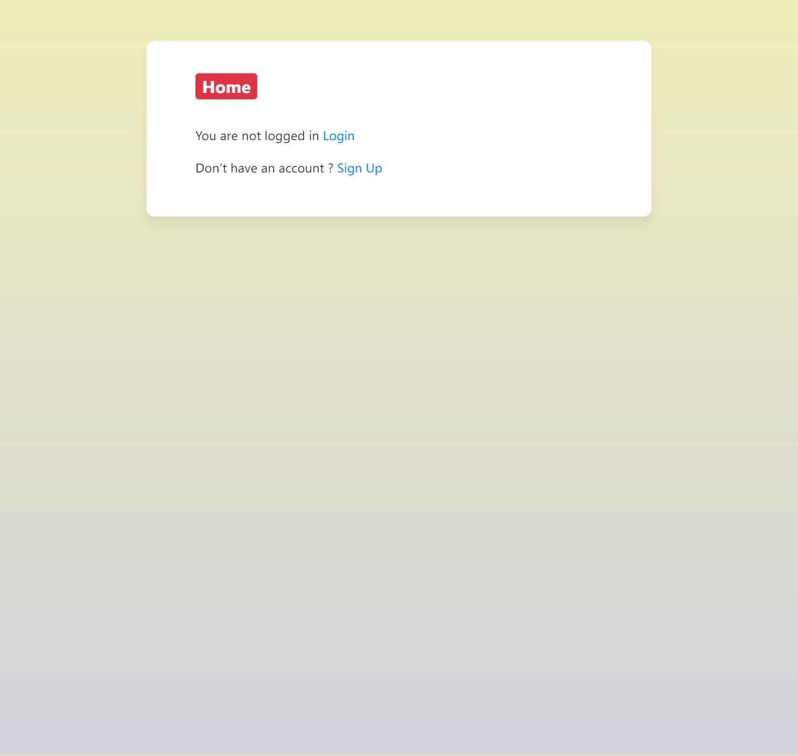

# Django Login Registration

A Django project with basic user functionality.

### Screen Shots
| Log In | Create an account |
| -------|--------------|
|  |  |

| Default Page | User Detail |
| ---------------|------------------|
|  |  |

### Functionality
* Log in
* Create an account
* Log out
* Show Details after Login

### Installing
Clone the project
```
git clone https://github.com/anu0567/django-login-registartion.git
cd django-login-registartion
```
Apply Migration
```
python manage.py migrate
```

### Running

#### A development server

Just run this command:

```
python source/manage.py runserver
```
